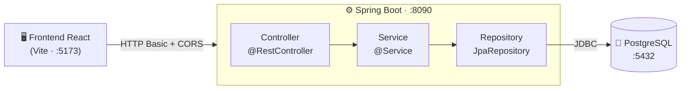
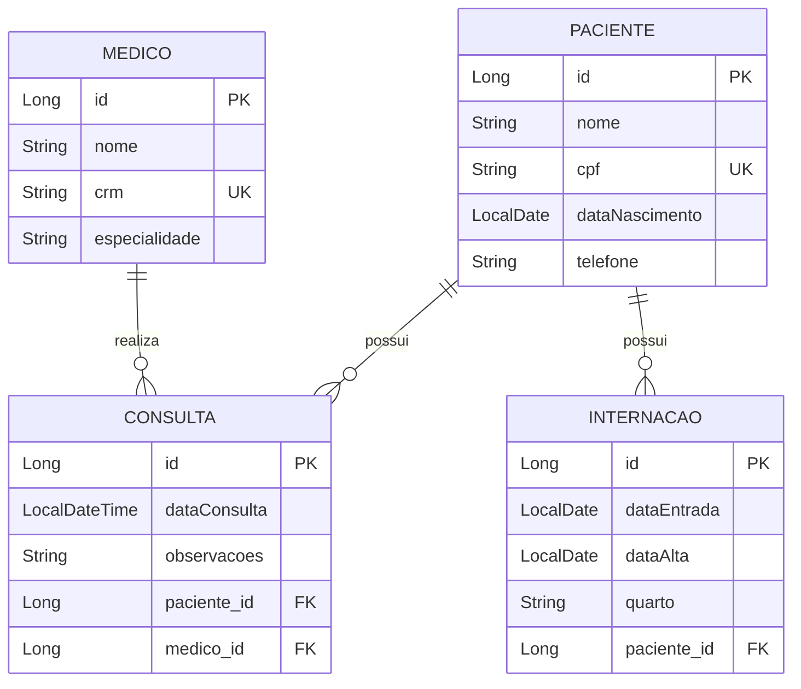

<!-- ╔══════════════════════════ HEADER (banner wave animado) ══════════════════════════╗ -->

<div align="center">


[](#-hospital--sistema-de-gestão-hospitalar)

<!-- ⬇️ Substitua os links abaixo pelos SEUS endereços de GitHub e LinkedIn ⬇️ -->
[](https://github.com/andrebecker84)
[](https://www.linkedin.com/in/becker84)

<br/>

# 🏥 Hospital · Sistema de Gestão Hospitalar

**API REST para gestão de pacientes, médicos, consultas e internações**

<sub>DR1-AT · Engenharia de Softwares Escaláveis</sub>

<br/>


[](https://github.com/andrebecker84/servicesAT/blob/main/doc/RELATORIO_AT.md)

<sub>Frontend React com vídeo em loop no hero · tipografia DM Sans + Outfit · ícones Tabler</sub>

</div>

---

##  Índice

1. [Visão Geral](#-visão-geral)
2. [Stack Tecnológica](#-stack-tecnológica)
3. [Pré-requisitos](#-pré-requisitos)
4. [Início Rápido](#-início-rápido)
5. [Frontend](#-frontend)
6. [Autenticação](#-autenticação)
7. [Referência da API](#-referência-da-api)
8. [Modelo de Domínio](#-modelo-de-domínio)
9. [Dados Iniciais](#-dados-iniciais)
10. [Testes](#-testes)
11. [Deploy com Docker](#-deploy-com-docker)
12. [Estrutura do Projeto](#-estrutura-do-projeto)
13. [Créditos](#-créditos)
14. [Relatório Técnico](https://github.com/andrebecker84/servicesAT/blob/main/doc/RELATORIO_AT.md)

---

##  Visão Geral

Um hospital precisa gerenciar **pacientes**, **médicos**, **consultas** e **internações**.
Esta API REST resolve o problema com uma arquitetura limpa em **três camadas**
(`Controller → Service → Repository`), **PostgreSQL** como banco relacional principal,
**Spring Security** protegendo os endpoints e um **frontend React** para interação visual.



---

##  Stack Tecnológica

| Camada           | Tecnologia                                         |
|------------------|----------------------------------------------------|
| Linguagem        | Java 25 (LTS)                                       |
| Framework        | Spring Boot 4.0.6                                   |
| Persistência     | Spring Data JPA + PostgreSQL 18                     |
| Segurança        | Spring Security (HTTP Basic + BCrypt + CORS)        |
| Validação        | Spring Boot Validation (Bean Validation)           |
| Observabilidade  | Spring Boot Actuator (`/actuator/health`)          |
| Build            | Maven 3.9.16 (Wrapper)                             |
| Testes           | JUnit 5 · Mockito · MockMvc · H2 (perfil de teste) |
| Frontend         | React 19 · Vite 8 · React Router 7 · Tabler Icons 3 |
| Containers       | Docker · Docker Compose                            |

---

##  Pré-requisitos

- **Java 25+**
- **Maven 3.9.16+** (ou use o wrapper `./mvnw`)
- **Docker** + **Docker Compose** · para PostgreSQL e deploy
- **Node.js 20+** · para o frontend

---

##  Início Rápido

### 1. Subir o PostgreSQL

```bash
docker compose up -d postgres
```

### 2. Rodar a aplicação

```bash
./mvnw spring-boot:run
```

> A API sobe em <kbd>http://localhost:8090</kbd>

### 3. Verificar a saúde

```bash
curl http://localhost:8090/actuator/health
```

### 4. Ambiente completo (app + banco) em um comando

```bash
docker compose up --build
```

<details>
<summary><b>Outros comandos úteis</b></summary>

```bash
./mvnw test                      # roda os testes (H2 em memória, não precisa de PostgreSQL)
./mvnw package -DskipTests       # gera o JAR executável
java -jar target/hospital-1.0.0.jar   # executa o JAR
docker compose down -v           # para tudo e apaga os dados
```
</details>

---

##  Frontend

```bash
cd frontend
npm install
npm run dev
```

> Acesse <kbd>http://localhost:5173</kbd>

| Página       | Recurso                                                  |
|--------------|----------------------------------------------------------|
| Dashboard    | Hero com vídeo em loop · health check · estatísticas      |
| Pacientes    | Listar · cadastrar · remover                             |
| Médicos      | Listar · cadastrar                                       |
| Consultas    | Registrar consulta (paciente + médico)                   |
| Internações  | Registrar internação                                     |
| Ranking      | Médicos por nº de consultas (query JPQL)                 |

**Destaques visuais:** hero com **vídeo em loop** (3 clipes otimizados), imagem de fundo, cards em vidro fosco, navbar e footer clean, ícones [Tabler](https://tabler.io/icons) e tipografia DM Sans + Outfit.

> [!NOTE]
> O frontend (`:5173`) acessa a API (`:8090`) via **CORS** configurado no `SecurityConfig`.

---

##  Autenticação

Autenticação **HTTP Basic** com dois usuários em memória (senhas com **BCrypt**):

| Usuário | Senha      | Papel                                                          | Permissões                   |
|---------|------------|----------------------------------------------------------------|------------------------------|
| `admin` | `admin123` |  | leitura + escrita + exclusão |
| `user`  | `user123`  |    | apenas leitura (GET)         |

> [!IMPORTANT]
> O endpoint `GET /actuator/health` é **público** (necessário para o healthcheck do Docker).
> Tentativas sem autenticação retornam `401`; autenticado sem permissão retorna `403`.

---

##  Referência da API

> Legenda de métodos &nbsp;
> 
> 
> 
> 

###  Pacientes

| Método | Endpoint | Auth | Resposta | Descrição |
|--------|----------|------|----------|-----------|
|  | `/pacientes` | `ADMIN` |  | Cadastrar paciente |
|  | `/pacientes` | `USER` `ADMIN` |  | Listar pacientes |
|  | `/pacientes/{id}` | `USER` `ADMIN` |   | Buscar por ID |
|  | `/pacientes/{id}` | `ADMIN` |   | Remover paciente |

###  Médicos

| Método | Endpoint | Auth | Resposta | Descrição |
|--------|----------|------|----------|-----------|
|  | `/medicos` | `ADMIN` |  | Cadastrar médico |
|  | `/medicos` | `USER` `ADMIN` |  | Listar médicos |
|  | `/medicos/ranking` | `USER` `ADMIN` |  | Ranking por nº de consultas (JPQL) |

###  Consultas &  Internações

| Método | Endpoint | Auth | Resposta | Descrição |
|--------|----------|------|----------|-----------|
|  | `/consultas` | `ADMIN` |   | Registrar consulta |
|  | `/consultas` | `USER` `ADMIN` |  | Listar consultas |
|  | `/internacoes` | `ADMIN` |   | Registrar internação |
|  | `/internacoes` | `USER` `ADMIN` |  | Listar internações |

###  Actuator

| Método | Endpoint | Auth | Resposta | Descrição |
|--------|----------|------|----------|-----------|
|  | `/actuator/health` |  |  | Health check |

### Códigos de status retornados


<details>
<summary><b>Exemplos de requisição (cURL)</b></summary>

```bash
# Cadastrar paciente (ADMIN) → 201
curl -u admin:admin123 -X POST http://localhost:8090/pacientes \
  -H "Content-Type: application/json" \
  -d '{"nome":"Carlos Souza","cpf":"55544433322","dataNascimento":"1980-01-01","telefone":"(11) 90000-0000"}'

# Listar pacientes (USER) → 200
curl -u user:user123 http://localhost:8090/pacientes

# Registrar consulta (ADMIN) → 201
curl -u admin:admin123 -X POST http://localhost:8090/consultas \
  -H "Content-Type: application/json" \
  -d '{"dataConsulta":"2026-06-24T10:00:00","observacoes":"Check-up","pacienteId":1,"medicoId":1}'

# Ranking de médicos (JPQL) → 200
curl -u user:user123 http://localhost:8090/medicos/ranking
```
</details>

---

##  Modelo de Domínio



---

##  Dados Iniciais

Inseridos automaticamente na inicialização (`CommandLineRunner`, idempotente). O seed popula a
plataforma com dados realistas para demonstração: **12 médicos** (12 especialidades), **8 pacientes**,
**28 consultas** e **4 internações** (alimentando o ranking Top 10, as listagens e as estatísticas).

<table>
<tr><th>Médicos (exemplos)</th><th>Pacientes (exemplos)</th></tr>
<tr><td>

- Dr. Carlos Menezes · `CRM-12345/SP` · Cardiologista
- Dra. Ana Ferreira · `CRM-67890/RJ` · Ortopedista
- Dra. Beatriz Lima · Pediatra · Dr. Rafael Souza · Neurologista
- + Dermatologista, Ginecologista, Oncologista, Psiquiatra
- + Endocrinologista, Urologista, Oftalmologista, Reumatologista

</td><td>

- João Silva · CPF `12345678901`
- Maria Oliveira · CPF `98765432100`
- Pedro Santos · Juliana Costa · Lucas Pereira
- Carla Mendes · Bruno Carvalho · Fernanda Dias

</td></tr>
</table>

---

##  Testes

```bash
./mvnw test
```


| Tipo | Classe | Casos | Ferramentas |
|------|--------|:-----:|-------------|
| Unitário   | `PacienteServiceTest` | 6 | JUnit 5 · Mockito |
| Unitário   | `MedicoServiceTest`   | 3 | JUnit 5 · Mockito |
| Integração | `PacienteControllerTest` | 6 | `@SpringBootTest` · MockMvc · H2 |
| Contexto   | `HospitalApplicationTests` | 1 | `@SpringBootTest` |

Os testes de integração validam **status HTTP**, **estrutura JSON** e **persistência real**
(incluindo `401`/`403` de segurança). Os repositórios nos testes unitários são simulados com **Mock**.

---

##  Deploy com Docker

**`Dockerfile`** · *multi-stage build* (JDK + Maven para compilar → JRE enxuto para rodar).
**`docker-compose.yml`** · orquestra **app + PostgreSQL** com rede, volume e healthcheck.

```bash
docker compose up --build
```

```text
✔ Container hospital-postgres   Healthy
✔ Container hospital-app        Started   →  http://localhost:8090
```

> [!TIP]
> O `depends_on` com `condition: service_healthy` garante que a aplicação só inicie
> **após** o PostgreSQL estar pronto.

---

##  Estrutura do Projeto

```text
servicesAT/
├── src/main/java/com/hospital/
│   ├── HospitalApplication.java
│   ├── config/        DataInitializer · SecurityConfig
│   ├── controllers/   Paciente · Medico · Consulta · Internacao
│   ├── services/      Paciente · Medico · Consulta · Internacao
│   ├── models/        Paciente · Medico · Consulta · Internacao
│   ├── repositories/  JpaRepository de cada entidade
│   ├── dtos/          Request/Response + MedicoRankingDTO
│   └── exception/     GlobalExceptionHandler (@RestControllerAdvice)
├── src/test/java/com/hospital/
│   ├── service/       PacienteServiceTest · MedicoServiceTest
│   └── controller/    PacienteControllerTest
├── frontend/          React 19 + Vite + Tabler Icons
│   ├── public/videos/    clipes .mp4 otimizados (hero scrollytelling + cards de exames)
│   └── src/
│       ├── pages/         Dashboard · Pacientes · Medicos · Consultas · Internacoes · Ranking
│       ├── components/    Navbar · Footer · ScrollHero · Reveal · StatNumber · Modal · Toast
│       └── assets/        imagens de fundo (Unsplash)
├── http/                 arquivos .http (IntelliJ / VS Code REST Client) + env
├── doc/RELATORIO_AT.md    relatório técnico completo
├── Dockerfile
├── docker-compose.yml
├── LICENSE                MIT
└── README.md
```

> [!TIP]
> A pasta `http/` traz arquivos **`.http`** (Pacientes, Médicos, Consultas, Internações, Actuator)
> prontos para o **IntelliJ HTTP Client** ou a extensão **REST Client** do VS Code, com
> autenticação Basic já configurada em `http-client.env.json`.

---

##  Créditos

**Imagens** (uso gratuito sob a [Licença Unsplash](https://unsplash.com/license)):
- Fundo da página: **[Ricardo Gomez Angel](https://unsplash.com/pt-br/fotografias/pessoas-andando-em-edificio-de-concreto-branco-durante-o-dia-cq4UJnEhh54)** · Kilchberg, Suíça (23/09/2020)
- Seção "Saúde na palma da mão": **[nappy](https://unsplash.com/pt-br/fotografias/uma-pessoa-segurando-um-telefone-1Y7ynoLFFDY)** (27/10/2022)

**Vídeos** (otimizados para web; uso gratuito com atribuição):
- Hero · mãos/conexão: [Pixabay (152798)](https://pixabay.com/videos/couple-lovers-hands-love-street-152798/)
- Hero · pessoas: [cottonbro studio · Pexels (7224949)](https://www.pexels.com/pt-br/video/adultos-vista-traseira-brilhante-luminoso-7224949/)
- Hero / ações · médico e paciente: [Vecteezy (27950720](https://www.vecteezy.com/video/27950720-doctor-male-checks-blood-pressure-with-blood-pressure-and-heart-rate-monitor-with-a-digital-pressure-gauge-in-the-hospital-cardiology-medical-equipment-and-healthcare-awareness-concept) · [42648365](https://www.vecteezy.com/video/42648365-doctor-working-with-patient-in-hospital-closeup-rehabilitation-physiotherapy) · [23860396)](https://www.vecteezy.com/video/23860396-men-s-health-exam-with-doctor-or-psychiatrist-working-with-patient-having-consultation-on-diagnostic-examination-on-male-disease-or-mental-illness-in-medical-clinic-or-hospital-mental-health-service)
- Exames · neurologia: [Pixabay (206173)](https://pixabay.com/videos/brain-mind-knowledge-think-206173/)
- Exames · DNA: [Videezy](https://www.videezy.com/abstract/56587-3d-animation-graphic-of-human-dna-on-computer-screen)
- Exames · cardiovascular: [Pixabay (57691)](https://pixabay.com/videos/blood-vessels-human-body-vein-57691/)
- Exames · análises clínicas: [Tima Miroshnichenko · Pexels (9573756)](https://www.pexels.com/pt-br/video/rotacao-sangue-quimica-close-9573756/)

**Ícones:** [Tabler Icons](https://tabler.io/icons) (MIT) · **Badges:** [Shields.io](https://shields.io/) · **Licença do projeto:** [MIT](LICENSE).

<!-- ╔══════════════════════════ FOOTER (wave + social) ══════════════════════════╗ -->

<div align="center">

### Conecte-se

<!-- ⬇️ Substitua os links abaixo pelos SEUS endereços ⬇️ -->
[](https://github.com/andrebecker84)
[](https://www.linkedin.com/in/becker84)

<sub>Projeto acadêmico · DR1-AT · Engenharia de Softwares Escaláveis</sub>


</div>
